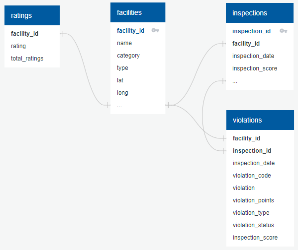

# Boulder County Health Scores and Reviews

## Background

Members of the group have worked in the restaurant industry and have experience with the inspection process. We thought it would be interesting ot build a model to test the relationship between a restaurant's health inspection score and its customer rating on Google. 

## Objective

Our group selected the topic of health inspection scores from Boulder Country, Colorado restaurants and the corresponding reviews provided to those establishments on Yelp and Google.

## Hypothesis

    - Can we predict the star rating of a restaurant based on their health inspection scores?
    - Is there a particular category of health violations that cause lower ratings?

## Project Steps:

1. Find Data Sources
2. Clean and Scrub the Data
3. Create a Database
4. Build a Machine Learning Model
5. Analyze Results
6. Create a Dashboard
7. Build an Interactive Website to Display Findings

## (1) Data Sources and Resources

#### Boulder County Health Inspection Data 

    -   (https://www.bouldercounty.org/families/food/restaurant-inspection-data/)
    -   This dataset includes public state data for each restautant in boulder county
    the datespan of the dataset is everything pre-2020, to eliminate COVID effects.
    the Boulder Inspection data includes a Facility ID as a unique identifier, which
    we also used throughout the project as each restaurants Unique ID.

#### Rating and Location Data
    -   Latitude, longitude, and google restaurant rating provided through the Google API 

#### Tools
    -    Python, Pandas, SKLearn, Tensorflow
    -    SQL, Postgres, QuickDBD, Github
    -    Google, Tableau, Google Docs and Slides

## (2) Scrubbing the data

1. Inspection data: basic filtering

    1. Filtered the health inspection data to look at only restaurants and only routine/regular restaurants inspections before 2020

2. Google data: locations, ratings, price level

    1. Using Google Geocode API, pulled the Google coordinates for the restaurants into the data set. The address provided in the inspection data was the key for matching the google coordinates. Quick note: if done again, would recommend pulling the entire geometry from Google and not just the coordinates. 

    2. Used Google Nearby Search API matching on Facility Name, Coordinates and ranked by distance. The first API call fielded 725 successful results out of 1078 to pull in Google rating, price level, status and total number of ratings. If a restaurant did not have one of the 4 datapoints, it would fail on matching any of them. With a little revamp to the code and another glass of wine, the try-except was updated to a try-continue. This yielded only 52 failed matches, compared to the 353 in the original pull. Success!

    3. A bit more data cleaning in Python to drop all restaurants with a 0 rating with Google, as the lowest rating you can recieve on Google is a 1. The code then was exported as a CSV for the Postgres Database. 

3. Inspection data database prep

    1. Filtered to include only facility ID and inspection and violation-related columns, as all other data will be provided by Google

    2. Investigated null values in Violation Type and Violation Status columns. Null Violation Type was decided unlikely to matter; null Violation Status would be addressed in SQL.

    3. After inspecting datatypes and changing Inspection Date to a datetime datatype, the data was exported to a new CSV to be loaded into the database.

Snapshot of the finalized dataset by County: 
Average Rating
Total Ratings
Average Price Level
Average Health Inspection Score
Total Number of Violations

## (3) Database Assembly

Since the data used for this project is static, we chose not to figure out how to host the database in a location accessible to all team members. Instead, the database was used to further assemble and rearrange the data. Targeted datasets to be used for machine learning were then created by selecting the necessary columns and exporting the data as CSVs.

1. The exported facilities and ratings data was loaded into Postgres, as-is aside from minor changes to column names.

2. Once loaded, the Price Level and Status columns were moved from the Ratings to the Facilities table for more coherent data grouping

3. Closer examination of additional non-restaurant facility categories and other abnormalities found in the process of loading and reshaping the data (Boulder County Jail is considered to have a "restaurant", for example, but seems unlikely to get good reviews, no matter how clean!). After determining which differed too greatly from the intended purpose of the analysis, the data for these facilities was copied into a Not_Restaurants table (in case it was needed later) and removed from the Facilities table

4. Inspections data was loaded, and the data from ineligible facilities was removed. 

5. An Inspections table was created to house only the facility ID, inspection date, and inspection score from each individual inspection. An inspection ID was generated as an identity column to help later in identifying violations observed during the same inspection.

6. A dataset containing facility ID, inspection date, inspection score, rating, and total ratings was assembled and exported for use in the inital round of machine learning.

7. A violations table was created to document the violations documented in each inspection. Since the source data contained several violation statuses that did not indicate that a violation had actually been observed, as well as sume null statuses, this was done in several steps:

    A. The table was created using rows where a facility had an "Out" status (meaning it was out of compliance)
    
    B. Data was extrapolated for facilities with a non-zero inspection score (indicating some violations had been observed) but no violations with an "Out" status:

        1. If the sum of violation points associated with the null rows from an inspection 
        matched the total inspection score, the violations were added to the Violations table 
        with an "Out" status, as they must have been the source of the inspection score.

        2. If the sum of violation points associated with the null rows from an inspection 
        did not match the total inspection score, it is most likely that these violations 
        were observed but not awarded their full point value. Since this could not be determined 
        for certain, they were added to the Violations table with a status of "Assumed Out."

## (4) Deployed Machine Learning Models

The process of choosing a Machine Learning (ML) model started with confirming the hypothesis that the Google Rating could be predicted using the Health Inspection Scores. Initial engineering of the datasets required binning the Health Inspection Scores (1 to 5) and the Google Ratings (1 to 5). The initial accuracy scores from three ML models (Logistic Regression, Support Vector Machine and RandomForest) showed a low accuracy level of 59%. In order to increase accuracy, the Google Ratings were binned to create a binary score (High and Low). Based on the distribution of all Google Ratings in the dataset, 4.51 was determined to be the dividing line between High and Low Google Ratings.

Providing a binary Google Rating increased the models' accuracy to about 72%. Even applying a gradient boosting tree (AdaBoost) to the mix increased the prediction power very little to 73%. In an attempt to increase accuracy, additional features of violation category and violation counts were added to the model.  

The Chi-Square test is used in feature selection to test the relationship between features and the predicted target which helps determine the best features to build the machine learning model. For machine learning, features that relate strongly to the target prediciton are most desirable. Small Chi-Square values indicate the feature and target are indepedent from each other. High Chi-Square values indicate that the feature and target are dependent and therefore those features are good candidates for model training. In this activity, two different datasets were used for feature selection: violation categories (did a facility ever get a particular type of violation) and violation counts (how often did a facility receive a particular violation).

The results of feature selection showed that the Violation Categories for the feature "Type of Facility" was more closely predictive (higher chi-square values) to the target (Google Rating). The highest facilities categories were "Restaurant with >200 seats" and small facilities "Limited Food Service, Convenience." Examples of Restaurants with >200 seats are corporate facilities such as Red Robin and Texas Roadhouse as well as local favorites The Roost and Beau Jo's. Example of Limited Food Service, Convenience range from local coffee shops to Starbucks.

Violation Counts revealed the highest dependency on "Water/Sewage" and "Toilets/Handwashing" violations. Facility type had some influence on the features selected from this activity. These results correlate well with the restaurant-industry adage, for the best health inspection scores, Start in the Restroom!

The top 7 features were used to compare Machine Learning Models.   

Five machine learning models were compared for accuracy using seven selected features. The target is Google Rating. The features include HealthScore, three health violation categories and three facility types and one facility category.

Results from the ML Comparison show equal accuracy between all of the machine learning models, providing about 72% accuracy in predicting the Google Rating. AdaBoost was added to the ML models when the regressions techniques continued to provide lacluster results. The goal of AdaBoost is to combine many weak classifiers into a single strong classifier. In this application, AdaBoost was used with one level of decision trees; increasing decision levels did not provide better accuracy. Additionally, Neural Networks also did not prove more accurate than the regressions models. Logistic Regression and AdaBoost provided similiar accuracy scores of 73%.

For simplicity sake and because it provided similiar results as more complex models, Logistic Regression is selected as the machine learning model for this project. Using this ML model, Google Ratings can be predicted from the Health Scores with 73% accuracy.

## Presentation
Below are the google slide presentation, which is embeded in the website. The websote captures the narrative to tell the story of the slides but in a more hands on way.

## (7) Dat Interactive Website
 Website Build out :

 Interactive Pieces:

## Summary
Overall, the machine learning model can predict the the google rating with ~70% accuracy. However, reversing the input and output does not yield a model that can predict any accuratecy. This means that the model cannot predict the health inspection score by using the google rating as an input.

A second analysis dives into if there are any violation categories in particular which drive a stronger correlation with a lower google rating. To get an idea of the number of times the violation was was issued by category comapred to the sum of the inspection score points as a result. Not all violations are treated equally in terms of final inspection score.

## Results

## Recomendations?
