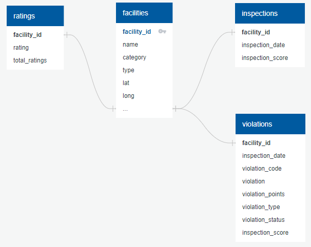

# Boulder County Health Scores and Reviews

## Background

Members of the group have worked in the restaurant industry and have experience with the inspection process. We thought it would be interesting ot build a model to test the relationship between a restaurant's health inspection score and its customer rating on Google. 

## Objective

Our group selected the topic of health inspection scores from Boulder Country, Colorado restaurants and the corresponding reviews provided to those establishments on Yelp and Google.

## Hypothesis

    - Can we predict the star rating of a restaurant based on their health inspection scores?
    - Is there a particular category of health violations that cause lower ratings?

## Project Steps:

1. Find Data Sources
2. Clean and Scrub the Data
3. Create a Database
4. Build a Machine Learning Model
5. Analyze Results
6. Create a Dashboard
7. Build an Interactive Website to Display Findings

Team Rainbow Unicorn Kitty Communication Protocol : Regular Tuesday, Thursday and Sunday meetings. Various other meetings depending on the workload and piece. General notes and notes from each meeting live in a shared Google document, and all other communication is done through a group slack channel.

## (1) Data Sources and Resources

#### Boulder County Health Inspection Data 
    - (https://www.bouldercounty.org/families/food/restaurant-inspection-data/)
    - This dataset includes public state data for each restautant in boulder county
    the datespan of the dataset is everything pre-2020, to eliminate COVID effects.
    the Boulder Inspection data includes a Facility ID as a unique identifier, which
    we also used throughout the project as each restaurants Unique ID.

#### Rating and Location Data
    - Latitude, longitude, and google restaurant rating provided through the Google API 

#### Tools
    -    Python, Pandas, SQL, Postgres, Google, SKLearn, Tableau, Google Docs and Slides 

## (2) Scrubbing the data

1. Inspection data: basic filtering

    1. Filtered the health inspection data to look at only restaurants and only routine/regular restaurants inspections before 2020

2. Google data: locations, ratings, price level

    1. Using Google Geocode API, pulled the Google coordinates for the restaurants into the data set. The address provided in the inspection data was the key for matching the google coordinates. Quick note: if done again, would recommend pulling the entire geometry from Google and not just the coordinates. 

    2. Used Google Nearby Search API matching on Facility Name, Coordinates and ranked by distance. The first API call fielded 725 successful results out of 1078 to pull in Google rating, price level, status and total number of ratings. If a restaurant did not have one of the 4 datapoints, it would fail on matching any of them. With a little revamp to the code and another glass of wine, the try-except was updated to a try-continue. This yielded only 52 failed matches, compared to the 353 in the original pull. Success!

    3. A bit more data cleaning in Python to drop all restaurants with a 0 rating with Google, as the lowest rating you can recieve on Google is a 1. The code then was exported as a CSV for the Postgres Database. 

3. Inspection data database prep

    1. Filtered to include only facility ID and inspection and violation-related columns, as all other data will be provided by Google

    2. Investigated null values in Violation Type and Violation Status columns. Null Violation Type was decided unlikely to matter; null Violation Status would be addressed in SQL.

    3. After inspecting datatypes and changing Inspection Date to a datetime datatype, the data was exported to a new CSV to be loaded into the database.

## (3) Database Assembly

1. The exported facilities and ratings data was loaded into Postgres, as-is aside from minor changes to column names.

2. Once loaded, the Price Level and Status columns were moved from the Ratings to the Facilities table for more coherent data grouping

3. Closer examination of additional non-restaurant facility categories and other abnormalities found in the process of loading and reshaping the data (Boulder County Jail is considered to have a "restaurant", for example, but seems unlikely to get good reviews, no matter how clean!). After determining which differed too greatly from the intended purpose of the analysis, the data for these facilities was copied into a Not_Restaurants table (in case it was needed later) and removed from the Facilities table

4. Inspections data was loaded, and the data from ineligible facilities was removed. 

5. An Inspections table was created to house only the facility ID, inspection date, and inspection score from each individual inspection.

6. A dataset containing facility ID, inspection date, inspection score, rating, and total ratings was assembled and exported for use in the inital round of machine learning.

7. A violations table was created to document the violations documented in each inspection. Since the source data contained several violation statuses that did not indicate that a violation had actually been observed, as well as sume null statuses, this was done in several steps:

    A. The table was created using rows where a facility had an "Out" status (meaning it was out of compliance)
    
    B. Data was extrapolated for facilities with a non-zero inspection score (indicating some violations had been observed) but no violations with an "Out" status:

        1. If the sum of violation points associated with the null rows from an inspection matched the total inspection score, the violations were added to the Violations table with an "Out" status, as they must have been the source of the inspection score.

        2. If the sum of violation points associated with the null rows from an inspection did not match the total inspection score, it is most likely that these violations were observed but not awarded their full point value. Since this could not be determined for certain, they were added to the Violations table with a status of "Assumed Out."

## (4) Deployed Machine Learning Models
#### Decision Tree 

    The Boulder County Health Inspections Scores were obtained. The features selected for the first analysis were the Health Inspection Score, Facility Type and Facility Category. These features were used to train the model in trying to predict the Yelp Rating per facility.

The first step in engineering the features for the machine learning model used the filtered dataset to:

 - Eliminate all location data so as not to overburden the model
 - Average the inspection scores for all routine and regular health inspections by facility
    - This was difficult to eliminate the duplicate rows without losing details (pivot table and merge)
 - Bin the averaged health inspection scores to match the Health Department ratings
 - Create randomized Yelp Ratings to test the model
 - Use Random Forest model as it is fast, simple and flexible
 - Easy to use during the initial model development process, to see how it performs
 - Provides a good indicator of the importance it assigns to features
 - Limitations include: fast to train, but quite slow to create predictions once they are trained
 - May need to switch to a neural network, for the second phase which has a lot of different feature types

potential features:
type of facility
category of facility

## Summary

## Results

## Reccomendations?
