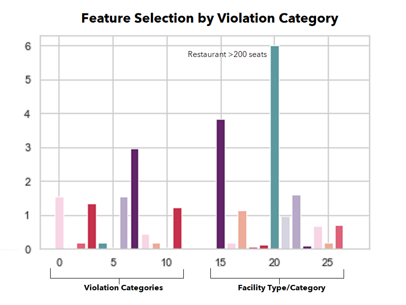

# Boulder County Health Scores and Reviews

## Background

Members of the group have worked in the restaurant industry and have experience with the health inspection process. There are well regarded rules passed down from manager to manager in ways of improving a facility's ability to pass the health inspection process. We thought it would be interesting to build a data driven model to test the relationship between a restaurant's health inspection score and its customer rating on Google and to further test the correlation of the types of health inspection violations that contribute to customer's perceptions of the restaurant. 

## Objective

The topic of health inspection scores from Boulder Country, Colorado restaurants and the corresponding reviews provided to those establishments on Google were the focus of this project.

## Hypothesis
- There is a correlation between health inspection scores and Google ratings.
- Some violation categories have a higher impact on Google ratings than others.

## Project Steps:

1. Find Data Sources
2. Clean and Scrub the Data
3. Create a Database
4. Build a Machine Learning Model
5. Analyze Results
6. Create a Dashboard
7. Build an Interactive Website to Display Findings

## (1) Data Sources and Resources

#### Boulder County Health Inspection Data 

https://www.bouldercounty.org/families/food/restaurant-inspection-data/
- This dataset includes public state health department data for restaurant and other facilities that serve food in Boulder County, Colorado.
-  While data through the present day is available, we limited our scope to inspections before 2020,
     to eliminate effects due to the COVID-19 pandemic.
- The Boulder Inspection data includes a Facility ID as a unique identifier, which was
    used throughout the project as each restaurant's Unique ID.

#### Rating and Location Data
- Latitude, longitude, and Google restaurant ratings were provided through the Google API. 

#### Tools
- Python, Pandas, SKLearn, Tensorflow
- SQL, Postgres, QuickDBD, Github
- Google, Tableau, Trello, Google Docs and Slides

## (2) Scrubbing the Data

1. Inspection data: basic filtering

    A. Health inspection data was filtered to select only restaurants with routine/regular health inspections from 2013 (first year of data availability) through 2019.

2. Google data: locations, ratings, price level

    A. Using Google Geocode API, the Google coordinates for the restaurants were imported into the data set. The address provided in the inspection data was the key for matching the Google coordinates. If repeated, we would recommend pulling the entire geometry from Google and not just the coordinates. 

    B. Used the Google Nearby Search API with matching on Facility Name and Coordinates and ranked by distance. The first API call fielded 725 successful results out of 1078 to incorporate Google rating, price level, status and total number of ratings. If a restaurant did not have one of these 4 datapoints, it would fail on matching any of them. With adjustments to the code and another glass of wine, the try-except was updated to a try-continue. This yielded only 52 failed matches, compared to the 353 in the original pull. Success!

    C. A bit more data cleaning in Python to drop all restaurants with a 0 rating with Google, as the lowest rating you can recieve on Google is a 1. The code then was exported as a CSV for the Postgres Database. 

3. Inspection data database prep

    A. Filtered to include only Facility ID and inspection and violation-related columns, as all other data will be provided by Google.

    B. Investigated null values in Violation Type and Violation Status columns. Null Violation Type was ignored; null Violation Status would be addressed in SQL.

    C. After inspecting datatypes and changing Inspection Date to a datetime datatype, the data was exported to a new CSV to be loaded into the database.

Snapshot of the finalized data by city: 
- Average Rating
- Total Ratings
- Average Price Level
- Average Health Inspection Score
- Total Number of Violations

## (3) Database Assembly

Since the data used for this project is static, we chose not to figure out how to host the database in a location accessible to all team members. Instead, the database was used to further assemble and rearrange the data. Targeted datasets to be used for machine learning were then created by selecting the necessary columns and exporting the data as CSVs.

### Assembly

1. The exported facilities and ratings data were loaded into Postgres, as-is aside from minor changes to column names.

2. Once loaded, the Price Level and Status columns were moved from the Ratings to the Facilities table for more coherent data grouping.

3. Closer examination of additional non-restaurant facility categories and other abnormalities found in the process of loading and reshaping the data (Boulder County Jail is considered to have a "restaurant", for example, but seems unlikely to get good reviews, no matter how clean!). After determining which differed too greatly from the intended purpose of the analysis, the data for these facilities was copied into a Not_Restaurants table (in case it was needed later) and removed from the Facilities table

4. Inspections data was loaded and the data from ineligible facilities was removed. 

5. An Inspections table was created to house only the facility ID, inspection date, and inspection score from each individual inspection. An inspection ID was generated as an identity column to help later in identifying violations observed during the same inspection.

6. A violations table was created to document the violations documented in each inspection. Since the source data contained several violation statuses that did not indicate that a violation had actually been observed, as well as some null statuses, this was done in several steps:

    A. The table was created using rows where a facility had an "Out" status (meaning it was out of compliance).
    
    B. Data was extrapolated for facilities with a non-zero inspection score (indicating some violations had been observed) but no violations with an "Out" status:
    
    * If the sum of violation points associated with the null rows from an inspection matched the total inspection score, the violations were added to the Violations table with an "Out" status, as they must have been the source of the inspection score.

    * If the sum of violation points associated with the null rows from an inspection did not match the total inspection score, it is most likely that these violations were observed but not awarded their full point value. Since this could not be determined for certain, they were added to the Violations table with a status of "Assumed Out."

    Both "Out" and "Assumed Out" were used for machine learning.

7. In the process of creating the violations table, we realized that the violations came from two separate lists: one specific to Boulder County that was used for inspections prior to 2019, and a national version that was adopted in 2019. Since these violations had different codes and partial but incomplete conceptual overlap, a crosswalk was created to translate from each pre-2019 violation to the closest later equivalent. Since the "new" violation codes were intended for use if we did analysis at the level of individual violations, this was created as a many-to-one relationship from old to new violations. Since the pre-2019 system was subdivided into categories that might be more productive for machine learning tha the individual violations, both old and new violations were into the old categories, though a few had to be merged the new violations did not fit neatly into them. These categories were included in the crosswalk, which was created as a CSV and loaded into the database.

8. Using the crosswalk, a violations_norm table was created to translate all old violations to their new equivalent, including their violation category.

### Export

1. For machine learning

    1. A dataset containing facility ID, inspection date, inspection score, rating, total ratings, and was assembled and exported for use in the inital round of machine learning.

    2. To facilitate machine learning using violations, a series of pivot tables were created and exported:
        * A table containing each facility id and a list of all violations, with a binary indicator of whether the facility had ever received each violation during one of its inspections.

        * A table containg each facility id and a list of all violations, with a count of how many times the facility had received each violation across all inspections performed there.

        * A table containing each facility id and a list of all violations categories, with a binary indicator of whether the facility had ever received a violation in each category during one of its inspections.

        * A table containg each facility id and a list of all violations, with a count of how many times the facility had received violations in each category across all inspections performed there.

    
    
2. For visualization

    A. A dataset was created for visualizations in tableau, including total ratings, average inspection score, average number of violations, and total number of inspections in addition to all facility data.

    B. A human-readable violations crosswalk was created for use in interpreting violations data, including the code and title for violations under both the old and new systems, as well as the violation category code and title.

    C. A list of all violation titles at each facility was created for lookup via the website.

## (4) Machine Learning Model Selection

The process of choosing a Machine Learning (ML) model started with confirming the hypothesis that the Google Rating could be predicted using the Health Inspection Scores. Initial engineering of the datasets required binning the Health Inspection Scores (1 to 5) and the Google Ratings (1 to 5). The initial accuracy scores from three ML models (Logistic Regression, Support Vector Machine and RandomForest) showed a low accuracy level of 59%. In order to increase accuracy, the Google Ratings were binned to create a binary score (High and Low). Based on the distribution of all Google Ratings in the dataset, 4.51 was determined to be the dividing line between High and Low Google Ratings.

Providing a binary Google Rating increased the models' accuracy to about 72%. Even applying a gradient boosting tree (AdaBoost) to the mix increased the prediction power very little to 73%. In an attempt to increase accuracy, additional features of violation category and violation counts were added to the model.  

The Chi-Square test is used in feature selection to test the relationship between features and the predicted target which helps determine the best features to build the machine learning model. For machine learning, features that relate strongly to the target prediciton are most desirable. Small Chi-Square values indicate the feature and target are indepedent from each other. High Chi-Square values indicate that the feature and target are dependent and therefore those features are good candidates for model training. In this activity, two different datasets were used for feature selection: violation categories (did a facility ever get a particular type of violation) and violation counts (how often did a facility receive a particular violation).

The results of feature selection showed that the Violation Categories for the features "Type" and "Category of Facility" were more closely predictive (higher chi-square values) to the target (Google Rating). The facility-related features with the highest values were "Restaurant with >200 seats" and small facilities "Limited Food Service, Convenience." Examples of "Restaurant with >200 seats" are corporate facilities such as Red Robin and Texas Roadhouse, as well as local favorites The Roost and Beau Jo's. Examples of "Limited Food Service, Convenience" range from local coffee shops to Starbucks. These facilities are not more likely to have better Google ratings or inspections scores, but our Machine Learning algorithm is better able to predict the relationship between the two for facilities of this type.

Violation Counts revealed the highest dependency on "Water/Sewage" and "Toilets/Handwashing" violations. Facility type had some influence on the features selected from this activity. These results correlate well with the restaurant-industry adage: for the best health inspection scores, start in the Restroom!

The top 7 features were used to compare Machine Learning Models.   

Five machine learning models were compared for accuracy using seven selected features. The target is Google Rating. The features include HealthScore, three health violation categories and three facility types and one facility category.

Results from the ML Comparison show equal accuracy between all of the machine learning models, providing about 72% accuracy in predicting the Google Rating. AdaBoost was added to the ML models when the regressions techniques continued to provide lacluster results. The goal of AdaBoost is to combine many weak classifiers into a single strong classifier. In this application, AdaBoost was used with one level of decision trees; increasing decision levels did not provide better accuracy. Additionally, Neural Networks also did not prove more accurate than the regressions models. Logistic Regression and AdaBoost provided similiar accuracy scores of 73%.

 

For simplicity's sake and because it provided comparable results to more complex models, Logistic Regression is selected as the machine learning model for this project. Using this ML model, Google Ratings can be predicted from the Health Scores with 73% accuracy.

## Presentation
Below is the Google slide presentation, which is embedded in the website. Our actual website will be used in our presentation as an interactive means of experiencing the narrative of our analysis.

## (7) Interactive Website Build
#### Website Build out :

#### Interactive Pieces:
We have two interactive Tableau dashboards integrated into our website:

[Boulder Health Data Score Exploration](https://public.tableau.com/app/profile/kyler.chavez/viz/boulder_health_data_score_exploration/ScoreExploration) explores overall trends in the data

[Boulder County Inspections and Ratings](https://public.tableau.com/app/profile/kelsey.mosbarger/viz/BoulderCountyInspections/BoulderCountyInspectionsRatings) is geared towawrds helping a potential diner to choose a restaurant and includes relevant information for individual facilities.

## Summary

Overall, the machine learning model can predict whether a facility will receive a good or bad Google rating with ~70% accuracy. However, reversing the input and output does not yield a model that can make predictions with any level of accuracy. This means that the model cannot predict the health inspection score by using the Google rating as an input.

A second analysis dives into if there are any violation categories in particular which drive a stronger correlation with a lower Google rating. To get an idea of the number of times the violation was issued by category compared to the sum of the inspection score points as a result. Not all violations are treated equally in terms of final inspection score.

## Results

The selected machine learning model can succesfully make a binary prediction whether a facility will receive favorable or unfavorable reviews. The model cannot predict the health inspection score from the Google rating.

There are several health violation categories that drive the strongest correlation to the Google rating for a facility. The top violations that influence the Google rating are those in the water/sewage and toilets/handwashing categories.

## Recommendations

Based on the data analyzed during this project, our first recommendation to restaurants is to prioritize clean bathrooms. The data shows that this specific violation category has the strongest correlation to a negative Google rating.

The second recommendation for ongoing data analysis is to expand the data to include new jurisdictions. Developing a model that spans the state of Colorado would allow users to find a clean restaurant and data analysts to develop interesting geographic comparisons and more broadly generalizable conclusions. There are several challenges inherent to suh an expansion of our analysis, however: not only is health inspection data less publicly accessible in some counties, the datasets available do not have a standard structure. Due diligence is therefore required to normalize and clean all available datasets before combining them into a larger one.
